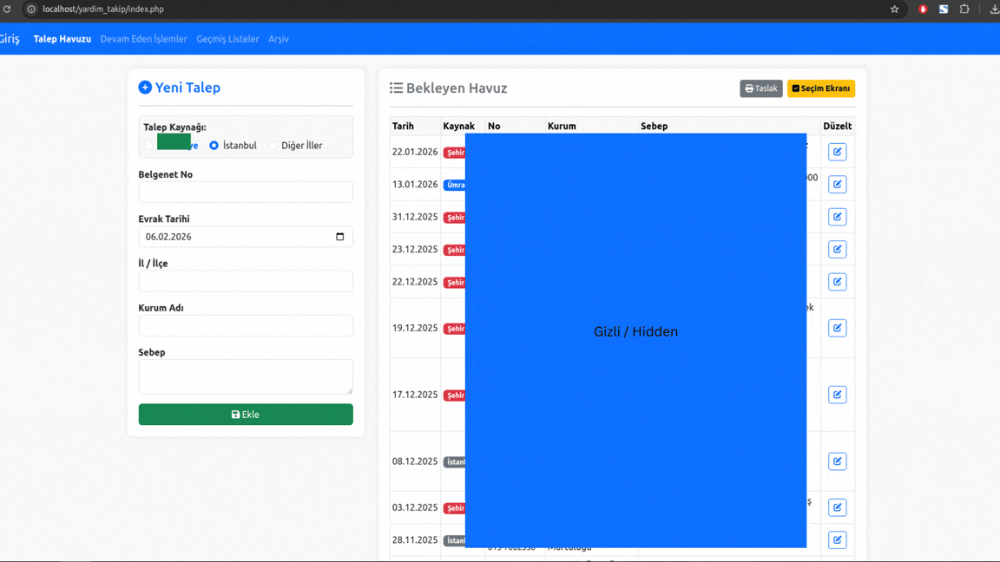

<h1 align="center">Aid Request Tracking System</h1>
<h3 align="center">Yardım Talep Takip Sistemi</h3>

  A professional system for tracking, managing, and monitoring aid requests. 
  Yardım taleplerinin düzenli, şeffaf ve etkili şekilde takip edilmesi için geliştirilmiş bir sistem.

  

---

## 🚀 About the Project | Proje Hakkında

### 🇬🇧 English
**Aid Request Tracking System** is designed to manage incoming aid requests in a centralized and structured way.  
It enables recording requests, tracking their status, monitoring related processes, and maintaining a clear overview of all aid demands through a single interface.

### 🇹🇷 Türkçe
**Yardım Talep Takip Sistemi**, gelen yardım taleplerinin tek merkezden düzenli ve şeffaf bir şekilde yönetilmesi amacıyla geliştirilmiştir.  
Taleplerin kayıt altına alınması, durumlarının izlenmesi ve süreçlerin kontrol altında tutulmasını sağlar.

---

## ✨ Key Features | Öne Çıkan Özellikler

### 🇬🇧
- 📝 Aid request registration  
- 📅 Date-based request tracking  
- 👤 Applicant / Request source management  
- ⚙️ Status tracking (Pending, Approved, Completed, etc.)  
- 📄 Reference / document number support  
- 🧾 Reporting and archiving infrastructure  
- 🔍 Quick search and filtering  

### 🇹🇷
- 📝 Yardım talebi kayıt sistemi  
- 📅 Tarih bazlı talep takibi  
- 👤 Talep sahibi / kaynak yönetimi  
- ⚙️ Durum takibi (Beklemede, Onaylandı, Tamamlandı vb.)  
- 📄 Belge / referans numarası desteği  
- 🧾 Raporlama ve arşivleme altyapısı  
- 🔍 Hızlı arama ve filtreleme  

---

## 🔄 Workflow | İşleyiş

### 🇬🇧
1. Aid request is submitted  
2. Request is recorded in the system  
3. Status is evaluated and updated  
4. Request is processed and archived  

### 🇹🇷
1. Yardım talebi alınır  
2. Talep sisteme kaydedilir  
3. Durumu değerlendirilir ve güncellenir  
4. Talep sonuçlandırılır ve arşivlenir  

---

## 🎯 Purpose | Amaç

### 🇬🇧
- Prevent request and record confusion  
- Ensure transparency and traceability  
- Reduce manual tracking errors  
- Create a sustainable aid request management system  

### 🇹🇷
- Talep ve kayıt karmaşasını önlemek  
- Şeffaf ve izlenebilir bir yapı sağlamak  
- Manuel takip hatalarını azaltmak  
- Sürdürülebilir bir yardım talep yönetim sistemi oluşturmak  

---

## 🏛️ Use Cases | Kullanım Alanları

### 🇬🇧
- Charity and foundation aid requests  
- Mosque and religious institution support requests  
- Local and international humanitarian aid operations  

### 🇹🇷
- Dernek ve vakıf yardım talepleri  
- Cami ve dinî kurum destek talepleri  
- Yerel ve uluslararası insani yardım çalışmaları  

---

  <i>The complete system workflow is demonstrated in the GIF above.</i> 
  <i>Sistemin tüm işleyişi yukarıdaki tanıtım GIF’inde gösterilmektedir.</i>

